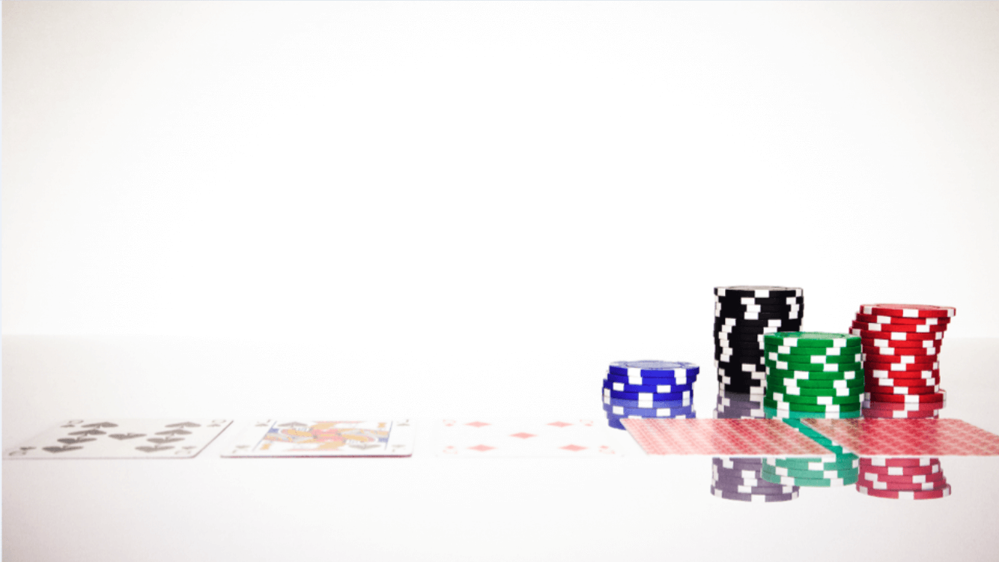
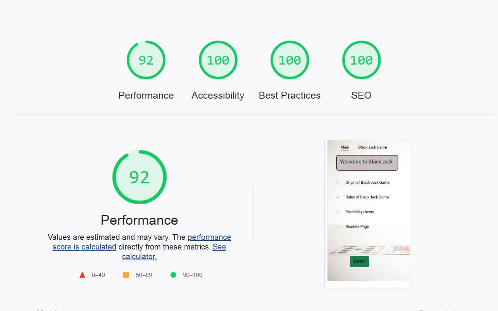

 
 Link to the GitHub page with the Blackjack Game: <a target="_blank" name="https://github.com/gretazas/black_jack_game">https://github.com/gretazas/black_jack_game</a>  
 Link to the page with the Blackjack Game: <a target="_blank" name="https://gretazas.github.io/black_jack_game/">https://gretazas.github.io/black_jack_game/</a>

 

# Acknowledgements

When the pandemic hit, I was forced to stay at home for six weeks. Instead of sitting there and doing nothing I decided to take action and learn something new. A Code Institute advertisement popped up. “ 5 Day Coding Challenge”. I started it and I coded all the way as far as JavaScript, through Udemy and videos on YouTube. There was this Blackjack Game challenge I decided to take part in. I was a complete copycat. I copied all the code down without any understanding of what it actually meant and even then, it was still magical! The way you write the code on one canvas and it appears on another canvas; felt amazing!

Unfortunately, shortly after those studies, my daughter was diagnosed with Type 1 Diabetes and my mother was diagnosed with stage 3 terminal cancer. They were both living with me and I was the only one there to take care of them.

Two and a half years later, I was browsing through SpringBoard and noticed that the Code Institute courses were available. I was so excited! I felt unbelievably lucky to get in.

Once I passed the JavaScript course and was ready for my portfolio2 and I knew exactly what I wanted to do: THE BLACKJACK GAME! 
To be honest- it intimidated me. I remember in the past, the code involved looked like a foreign language to me. Since I was ahead in my course, I had time to think it through. One day, I sat down, scribbled a few functions and the journey began… It was so adventurous. Function after function- the project was coming together.  

Back then, when I was originally doing the challenge all the cards were presented in the array and another array had all the values of each card. I came up with this idea where I name my images as numbers and call them straight away from the function where I get 'assets/images/' + \`${randomNumber}\` + '.png';
And added another function to assign a value of ten to all the cards >10.

The trickiest part was to add logic to the Ace card. Its value could be either 1 or 11 depending on the present score. So the bot decides according to the current score; if the score with the Ace value 11 is under 21 - its value is 11, otherwise Ace = 1;

I love JavaScript even though I haven't learnt much yet and it’s really challenging at times. Once I was joking around and wrote this message to my 13-year-old daughter:
		I put alarm for 9 o\`clock if (you`re up > 9 ) {
			return wake-me-up;
			console.log(‘Good morning Mom!’);
		} else {
			return I-sleep-until-alarm-rings;
			console.log(‘cock-a-doodle-do’);
		}
# Top
# Contents
* [Acknowledgements](#acknowledgements)
* [Contents](#contents)
* [Deployment](#deployment)
    * [Initial Deployment](#initial-deployment)
    * [How To Fork A Repository](#how-to-fork-a-repository)
    * [How To Clone A Repository](#how-to-clone-a-repository)
    * [How To Make A Local Clone](#how-to-make-a-local-clone)
* [Issues and bugs](#issues-and-bugs)
* [User experience](#user-experience)
    * [Landing page](#landing-page-would-have-four-links-forbr)
    * [Navigation bar](#navigation-bar-and-enter-button)
* [Future steps](#future-steps)
* [Built with intention to practise use](#built-with-intention-to-practise-use)
    * [HTML](#html)
    * [CSS](#css)
    * [JavaScript](#javascript)
    * [Git](#git)
* [Languages Used](#languages-used)
* [Proved By](#proved-by)
    * [W3C markup validation](#the-w3c-markup-validation-service)
    * [W3C css validation](#the-w3c-css-validation-service)
    * [Responsive Design](#responsive-design)
    * [Testing](#testing)
* [Frameworks, Libraries & Programs I Used:](#built-with-intention-to-practise-use)
* [Features](#features)
* [Contact](#contact)
* [Code](#code)
* [Focus group](#focus-group)

# Deployment

### Initial Deployment:

This site was deployed using GitHub Pages with the following the steps below:

1. Login or Sign Up to [GitHub](www.github.com).
2. Create a new repository named "a-better-world".
3. Once created, click on "Settings" on the navigation bar under the repository title.
4. Click on "Pages", on the left hand side below Secrets.
5. Under "Source", choose which branch you wish to deploy, In most cases it will be "main".
6. Choose which folder to deploy from, generally from "/root".
7. Click "Save", then wait for it to be deployed. It may take some time for the page to be fully deployed.
8. The URL will be displayed above the "source" section in GitHub Pages.

### How to Fork a Repository

1. Login or Sign Up to [GitHub](www.github.com).
2. On GitHub, go to [https://gretazas.github.io/black_jack_game/](hhttps://gretazas.github.io/black_jack_game/)".
3. In the top right corner, click "Fork".

### How to Clone a Repository

If you need to make a clone:    

1. Login in to [GitHub](www.github.com).
2. Fork the repository gretazas/black_jack_game using the steps above in [How To Fork a Repository](#HOW-TO-FORK-A-REPOSITORY).
3. Above the file list, click "Code".
4. Choose if you want to close using HTTPS, SSH or GitHub CLI, then click the copy button to the right.
5. Open Git Bash.
6. Change the directory to where you want your clone to go.
7. Type git clone and then paste the URL you copied in step 4.
8. Press Enter to create your clone.

### How to make a Local Clone

If you need to make a local clone:   

1. Login in to [GitHub](www.github.com).
2. Under the repository name, above the list of files, click "Code".
3. Here you can either Clone or Download the repository.
4. You should close the repository using HTTPS, clicking on the icon to copy the link.
5. Open Git Bash.
6. Change the current working directory to the new location, where you want the cloned directory to be.
7. Type git clone and then paste the URL you copied in step 4.
8. Press Enter, and your local clone will be created.

The site was deployed to Github pages using the following steps:
* In the Github repository, navigate to the settings tab.
* Scroll down and select Pages from the left side navigation menu to open Github pages.
* In the Source section, click on the dropdown menu and select the Master branch.
* Once the Master branch is selected the page will refresh to display a message stating "Your site is published at 

(<a href="#top">Back to top</a>)

# Issues and Bugs

 The line I was really stuck with was in the very last deal function. That function is responsible for refreshing the game and making it all clear to start the next one. I used .remove(‘img’) and it did the job. An error would come up at the console, so I started to investigate why.
#  
Eventually I had to get help and had a hard time comprehending that the appendChild node is not a literal print into .innerHTML.

Another issue I came up to was Google charts, I had difficulty with design, which left unresolved, could not get padding applied to elipse.
I also had to get help with the bug that did not show any errors at the console. This time there were a couple of styles clashing in responsive design.

Thanks to Code Institute and all the team behind it I was able to present my portfolio2 with confidence and pride.  

# User Experience

 - This page is for people who would like to relax and take a moment away from their routine to have a little fun and play a bit of Blackjack against the bot.
 - First time users should get an easy understanding of game tactics, possibilities in chance of getting the right card and getting the right idea how to play from links provided in landing page.
 - Constant visitors shold get a sence of adventure, relaxation and fun.
### Landing page would have four links for: 
* Origin of Blackjack Game.
* Rules of Blackjack Game.
* Possibility theory.
* Readme Page.

### Navigation bar and Enter button
* Navigation bar will let you go to Blackjack game and back to main.
* Enter button at the landing page will open the game page.

# Future Steps

* Make user accounts for constant visitors.
* Keep information charts of their winning data.
* To use web analytics to track visitor interaction.

(<a href="#top">Back to top</a>)

# Built with intention to practise use:

* Navigation of file tree
* Creating, copying, and removing files and directories

### HTML

* Semantic elements, tags
* Attributes

### CSS

* Class vs. id
* Selectors
* Typography
* Positioning and floats
* Color: hexadecimal, rgb and named

### JavaScript

* Pattern matching functionality
* A score tracking system
* The ability to play against the computer
* The site’s users want to play an online game that has elements of chance.

### Git

* Git & Git workflow
* git add
* git commit
* git push
* GitHub
* Create a repository
* Deploy to personal page

# Languages Used:
 
 
 

 

* Also used : 
  * [Python3 terminator](https://www.python.org/download/releases/3.0/)

(<a href="#top">Back to top</a>)

# Proved By:

## The W3C Markup Validation Service:

## The W3C CSS Validation Service:

## Lighthouse: 
 
     
'

# Responsive Design:

## Link to: [Am I Responsive](http://ami.responsivedesign.is/)

+ User would use a different layout on screens 1560px and smaller.
+ I used JavaScript to change button positions on smaller screens.
+ Win, lose and draw tables would get smaller.
+ Index.html wound get samller font and boxes would decrease acording to smaller screen size.

(<a href="#top">Back to top</a>)

# Testing

+ Checked Ace logic working:
  - If an Ace is worth 11 points when the player will not reach score over 21.
  - If an Ace is worth 1 point, the score with Ace worth 11 would go over 21.

+ Check once score exceed over 21:
  - Stop the game immediately.
  - "Bust!" message appears on the player's score tab.
  - Announce winner.

+ Digit in winnings tab:
  - Increases by one in wins, if the player won.
  - Increases by one in losses if the player lost.
  - Increases by one in draws with each draw.

+ Piechart
  - Graph changes to according amount of wins, losses and draws.

+ Responsive design:
  - Card position changes on smaller screens in order to have a better card view.
  - Button positions change for easy access.
  - Piechart and win tabs get smaller to fit the screen.

# Frameworks, Libraries & Programs I Used:

+ [Google Fonts](https://fonts.google.com/)

  - Google Fnts Was used for all the text content on the site pages.

+ [Git](https://git-scm.com/)

  - Git was used for version control by using the Gitpod terminal to add and commit to GIt and push to Github.

+ [GitPod](https://gitpod.io/)
    
  - GitPod was used as an IDE whilst coding this site.

+ [GitHub](https://github.com/)
    
  - GitHub is being used to store all the code for this project after being pushed from GitPod.

+ [Google Developers Tool](https://developers.google.com/web/tools)
    
  - Developer Tools was used for trouble shooting and trying new visual changes without it affecting the current code.

+ [Hover.css:](https://ianlunn.github.io/Hover/)
    Hover.css was used on the Social Media icons in the footer to add the float transition while being hovered over. 

# Features

- Navigation bar for index and game pages.
- Welcome heading.
- Links in index page with information relatad to Bkackjack game.
- Button to enter the game.
- Google piechart. [Link to Google piechart](https://developers.google.com/chart/interactive/docs/gallery/piechart)
- Input asking for players name. 
- Heading: 
  - Wishing good luck, congratulating with win and announcing loss or draw.
  - Including players name if provided.
- Buttons:
  - Hit - to show a card and start the game.
  - Stand - to stop player's game and pass turn to bot.
  - Deal - to start the game over.
  - Bot - just for design of provided information purpose.

# Contact

 https://github.com/gretazas 
Greta Baliunaite: [ https://www.facebook.com/greta.baliunaite]( https://gretazas.github.io/portfolio_1/)

# Code
* All code was written by myself and was learnt from [www.codeinstitute.net](https://www.codeinstitute.net) and [w3schools.com](https://www.w3schools.com/).
* Inspiration for the hero images was taken from the Love Running Walkthrough project from [www.codeinstitute.net](https://www.codeinstitute.net).
* Icons for the footer were taken from [FontAwesome](https://fontawesome.com/) and is cited in the attributes section of the footer.

# Focus Group
* I'd like to thank the following people for the help they gave me with this project:
  - My daughter Madelyne for helping me with README.md page and checking the game function. 
  - Sean, Ed and Gemma from Code Institute Tutor Assistance. 
  - Mentor Anthony.
  
   
   
![Safe](https://img.shields.io/badge/Stay-Safe-red?logo=data:image/svg%2bxml;base64,PHN2ZyBpZD0iTGF5ZXJfMSIgZW5hYmxlLWJhY2tncm91bmQ9Im5ldyAwIDAgNTEwIDUxMCIgaGVpZ2h0PSI1MTIiIHZpZXdCb3g9IjAgMCA1MTAgNTEwIiB3aWR0aD0iNTEyIiB4bWxucz0iaHR0cDovL3d3dy53My5vcmcvMjAwMC9zdmciPjxnPjxnPjxwYXRoIGQ9Im0xNzQuNjEgMzAwYy0yMC41OCAwLTQwLjU2IDYuOTUtNTYuNjkgMTkuNzJsLTExMC4wOSA4NS43OTd2MTA0LjQ4M2g1My41MjlsNzYuNDcxLTY1aDEyNi44MnYtMTQ1eiIgZmlsbD0iI2ZmZGRjZSIvPjwvZz48cGF0aCBkPSJtNTAyLjE3IDI4NC43MmMwIDguOTUtMy42IDE3Ljg5LTEwLjc4IDI0LjQ2bC0xNDguNTYgMTM1LjgyaC03OC4xOHYtODVoNjguMThsMTE0LjM0LTEwMC4yMWMxMi44Mi0xMS4yMyAzMi4wNi0xMC45MiA0NC41LjczIDcgNi41NSAxMC41IDE1LjM4IDEwLjUgMjQuMnoiIGZpbGw9IiNmZmNjYmQiLz48cGF0aCBkPSJtMzMyLjgzIDM0OS42M3YxMC4zN2gtNjguMTh2LTYwaDE4LjU1YzI3LjQxIDAgNDkuNjMgMjIuMjIgNDkuNjMgNDkuNjN6IiBmaWxsPSIjZmZjY2JkIi8+PHBhdGggZD0ibTM5OS44IDc3LjN2OC4wMWMwIDIwLjY1LTguMDQgNDAuMDctMjIuNjQgNTQuNjdsLTExMi41MSAxMTIuNTF2LTIyNi42NmwzLjE4LTMuMTljMTQuNi0xNC42IDM0LjAyLTIyLjY0IDU0LjY3LTIyLjY0IDQyLjYyIDAgNzcuMyAzNC42OCA3Ny4zIDc3LjN6IiBmaWxsPSIjZDAwMDUwIi8+PHBhdGggZD0ibTI2NC42NSAyNS44M3YyMjYuNjZsLTExMi41MS0xMTIuNTFjLTE0LjYtMTQuNi0yMi42NC0zNC4wMi0yMi42NC01NC42N3YtOC4wMWMwLTQyLjYyIDM0LjY4LTc3LjMgNzcuMy03Ny4zIDIwLjY1IDAgNDAuMDYgOC4wNCA1NC42NiAyMi42NHoiIGZpbGw9IiNmZjRhNGEiLz48cGF0aCBkPSJtMjEyLjgzIDM2MC4xMnYzMGg1MS44MnYtMzB6IiBmaWxsPSIjZmZjY2JkIi8+PHBhdGggZD0ibTI2NC42NSAzNjAuMTJ2MzBoMzYuMTRsMzIuMDQtMzB6IiBmaWxsPSIjZmZiZGE5Ii8+PC9nPjwvc3ZnPg==)

(<a href="#top">Back to top</a>)

