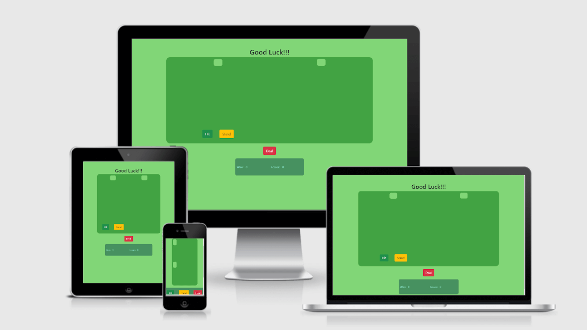

 
 Link to the page with the Black Jack Game: <a target = "_blank" name="https://github.com/gretazas/black_jack_game">https://github.com/gretazas/black_jack_game</a>  
 Link to the GitHub page with the Black Jack Game: <a target = "_blank" name="https://gretazas.github.io/black_jack_game/">https://gretazas.github.io/black_jack_game/</a>

# Acknowledgements

When the pandemic hit, I was forced to stay at home for six weeks. Instead of sitting there and doing nothing I decided to take action and learn something new. A Code Institute advertisement popped up. “5 Day Coding Challenge”. I started it and I coded all the way as far as JavaScript, through Udemy and videos on YouTube. There was this Black Jack Game challenge I decided to take part in. I was a complete copycat. I copied all the code down without any understanding of what it actually meant and even then, it was still magical! The way you write the code on one canvas and it appears on another canvas; it felt amazing!

Unfortunately, shortly after those studies, my daughter was diagnosed with Type 1 Diabetes and my mother was diagnosed with stage 3 terminal cancer. They were both living with me and I was the only one there to take care of them.

Two and a half years later, I was browsing through SpringBoard and noticed that the Code Institute courses were available. I was so excited! I felt unbelievably lucky to get in.

Once I passed the JavaScript course and was ready for my portfolio2 and I knew exactly what I wanted to do: THE BLACK JACK GAME! 
To be honest- it intimidated me. I remember in the past, the code involved looked like a foreign language to me. Since I was ahead in my course, I had time to think it through. One day, I sat down, scribbled a few functions and the journey began… It was so adventurous. Function after function- the project was coming together.  

Back then, when I was originally doing the challenge all the cards were presented in the array and another array had all the values of each card. I came up with this idea where I name my images as numbers and call them straight away from the function where I get 'assets/images/' + \`${randomNumber}\` + '.png';
And added another function to assign a value of ten to all the cards >10.

The trickiest part was to add logic to the Ace card. Its value could be either 1 or 11 depending on the present score. So the bot makes a decision according to current score; if the score with the Ace value 11 is under 21 - its value is 11, otherwise Ace = 1;

The line I was really stuck with was in the very last deal function. That function is responsible for refreshing the game and making it all clear to start the next one. I used .remove(‘img’) and it did the job. An error would come up at the console, so I started to investigate why.
#  
Eventually I had to get help and had a hard time comprehending that the appendChild node is not a literal print into .innerHTML.

I love JavaScript even though I haven't learnt much yet and it’s really challenging at times. Once I was joking around and wrote this message to my 13 year old daughter:
		I put alarm for 9 o\`clock if (you`re up > 9 ) {
			return wake me up;
			console.log(‘Good morning Mom!’);
		} else {
			return I sleep until alarm rings;
			console.log(New Audio = ‘rooster sound’);
		}
# 

Thanks to Code Institute and all the team behind it I was able to present my portfolio2 with confidence and pride.  

## This page is for people who would like to relax and take a moment away from their routine to have a little fun and play a bit of Black Jack against the bot.

  

### Built with intention to practise use:

* Navigation of file tree
* Creating, copying, and removing files and directories

  # HTML

* Semantic elements, tags
* Attributes

  # CSS

* Class vs. id
* Selectors
* Typography
* Positioning and floats
* Color: hexadecimal, rgb and named
* Git & Git workflow
* git add
* git commit
* git push
* GitHub
* Create a repository
* Deploy to personal page

  # JavaScript

* Pattern matching functionality
* A score tracking system
* The ability to play against the computer
* The site’s users want to play an online game that has elements of chance.

# Languages I Used:
 
 
 

 

 

 * [python3terminator](https://www.python.org/download/releases/3.0/)

# Frameworks, Libraries & Programs I Used:

[Hover.css:](https://ianlunn.github.io/Hover/)
    Hover.css was used on the Social Media icons in the footer to add the float transition while being hovered over. 

    Testing:

The W3C Markup Validator and W3C CSS Validator Services were used to validate every page of the project to ensure there were no syntax errors in the project.

[W3C Markup Validator](https://jigsaw.w3.org/css-validator/#validate_by_input) 
[W3C CSS Validator](https://jigsaw.w3.org/css-validator/#validate_by_input) 
(<a href="#top">back to top</a>)

## Contact

Greta Baliunaite: [ https://www.facebook.com/greta.baliunaite]( https://gretazas.github.io/portfolio_1/)

### Deployment
The site was deployed to Github pages using the following steps:
* In the Github repository, navigate to the settings tab.
* Scroll down and select Pages from the left side navigation menu to open Github pages.
* In the Source section, click on the dropdown menu and select the Master branch.
* Once the Master branch is selected the page will refresh to display a message stating "your site is published at [https://gretazas.github.io/black_jack_game/](hhttps://gretazas.github.io/black_jack_game/)"

### Code
* All code was written by myself and was learnt from [www.codeinstitute.net](https://www.codeinstitute.net) or [w3schools.com](https://www.w3schools.com/).
* Inspiration for the hero images was taken from the Love Running Walkthrough project from [www.codeinstitute.net](https://www.codeinstitute.net).
* Icons for the footer were taken from [FontAwesome](https://fontawesome.com/) and is cited in the attributes section of the footer.

### Focus Group
* I'd like to thank the following people for the help they gave me with this project:
  - My daughter Madelyne for helping me with README.md page and checking the game function. 
  - Sean and Gemma from Code Institute Tutor Assistance. 
  - 
   
   
![Safe](https://img.shields.io/badge/Stay-Safe-red?logo=data:image/svg%2bxml;base64,PHN2ZyBpZD0iTGF5ZXJfMSIgZW5hYmxlLWJhY2tncm91bmQ9Im5ldyAwIDAgNTEwIDUxMCIgaGVpZ2h0PSI1MTIiIHZpZXdCb3g9IjAgMCA1MTAgNTEwIiB3aWR0aD0iNTEyIiB4bWxucz0iaHR0cDovL3d3dy53My5vcmcvMjAwMC9zdmciPjxnPjxnPjxwYXRoIGQ9Im0xNzQuNjEgMzAwYy0yMC41OCAwLTQwLjU2IDYuOTUtNTYuNjkgMTkuNzJsLTExMC4wOSA4NS43OTd2MTA0LjQ4M2g1My41MjlsNzYuNDcxLTY1aDEyNi44MnYtMTQ1eiIgZmlsbD0iI2ZmZGRjZSIvPjwvZz48cGF0aCBkPSJtNTAyLjE3IDI4NC43MmMwIDguOTUtMy42IDE3Ljg5LTEwLjc4IDI0LjQ2bC0xNDguNTYgMTM1LjgyaC03OC4xOHYtODVoNjguMThsMTE0LjM0LTEwMC4yMWMxMi44Mi0xMS4yMyAzMi4wNi0xMC45MiA0NC41LjczIDcgNi41NSAxMC41IDE1LjM4IDEwLjUgMjQuMnoiIGZpbGw9IiNmZmNjYmQiLz48cGF0aCBkPSJtMzMyLjgzIDM0OS42M3YxMC4zN2gtNjguMTh2LTYwaDE4LjU1YzI3LjQxIDAgNDkuNjMgMjIuMjIgNDkuNjMgNDkuNjN6IiBmaWxsPSIjZmZjY2JkIi8+PHBhdGggZD0ibTM5OS44IDc3LjN2OC4wMWMwIDIwLjY1LTguMDQgNDAuMDctMjIuNjQgNTQuNjdsLTExMi41MSAxMTIuNTF2LTIyNi42NmwzLjE4LTMuMTljMTQuNi0xNC42IDM0LjAyLTIyLjY0IDU0LjY3LTIyLjY0IDQyLjYyIDAgNzcuMyAzNC42OCA3Ny4zIDc3LjN6IiBmaWxsPSIjZDAwMDUwIi8+PHBhdGggZD0ibTI2NC42NSAyNS44M3YyMjYuNjZsLTExMi41MS0xMTIuNTFjLTE0LjYtMTQuNi0yMi42NC0zNC4wMi0yMi42NC01NC42N3YtOC4wMWMwLTQyLjYyIDM0LjY4LTc3LjMgNzcuMy03Ny4zIDIwLjY1IDAgNDAuMDYgOC4wNCA1NC42NiAyMi42NHoiIGZpbGw9IiNmZjRhNGEiLz48cGF0aCBkPSJtMjEyLjgzIDM2MC4xMnYzMGg1MS44MnYtMzB6IiBmaWxsPSIjZmZjY2JkIi8+PHBhdGggZD0ibTI2NC42NSAzNjAuMTJ2MzBoMzYuMTRsMzIuMDQtMzB6IiBmaWxsPSIjZmZiZGE5Ii8+PC9nPjwvc3ZnPg==)

